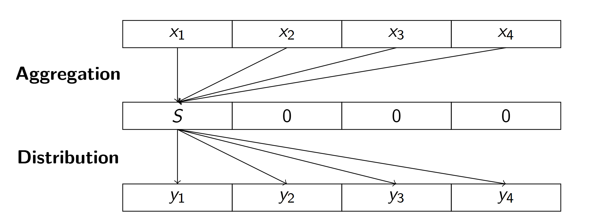

# D - Multiset

## Analysis

Let's check when to output $$-1$$ first.

{: .note-title}
> Observation
>
> The answer is $$-1$$ if and only if the sum of elements of $$X$$ and sum of elements of $$Y$$ is different.

{: .note-title}
> Proof
>
> ($$\leftarrow$$) The operation $$-1$$ at some index $$i$$ and $${+1}$$ at some index $$j$$. This means that the sum of elements in the multiset remains unchanged. Therefore, it is impossible to make $$X = Y$$ if their sum is different.
>
> ($$\rightarrow$$) This proposition means that it is always possible to make them equal if the sum of elements is the same. One can just make all elements in $$X$$ except the first one to be zero. By this, you can just always $$-1$$ from the first index and $${+1}$$ to the index $$j$$ (for all $$j$$) $${y_j}$$ times.
>
> 

To find the minimum operations required, we can adopt a greedy strategy:

1. Sort both array in ascending order
2. The answer is
$$
\frac{1}{2}\sum_{i=1}^{n}{|x_i - y_i|}
$$

{: .note-title}
> Proof
>
> From the previous observation, we know that it is possible only if the sum of elements of $$X$$ and $$Y$$ are the same.
>
> Therefore, we can separate the operation $$-1$$ and $$+1$$ independently. That is, one operation is $$-1$$ to some index $$j$$ with cost $$\frac{1}{2}$$ and another operation is $$+1$$ to some index $$j$$ with cost $$\frac{1}{2}$$.
>
> The problem is reduced to finding a **one-to-one mapping** between set $$X$$ and set $$Y$$.
>
> - If $$x_i$$ is mapped with $$y_j$$, the cost is $$\frac{1}{2} \cdot \lvert y_j - x_i \rvert$$.
> - The cost of the mapping is $$\frac{1}{2} \cdot \sum_{\text{all mappings}}{\lvert y_j - x_i \rvert}$$.
>
> The optimal strategy is to choose the smallest $$x$$ with the smallest $$y$$. You may refer to some similar problems in Geekforgeek (Assign mice to holes). The proof is by case discussion. Please see .

## Codes



```c
#include <inttypes.h>
#include <stdint.h>
#include <stdio.h>
#include <stdlib.h>

/**
 * Compare two integers.
 *
 * @param a First integer
 * @param b Second integer
 * @return Difference between the two integers
 */
int compare(const void *a, const void *b) { return *(int *)a - *(int *)b; }

/**
 * Finds minimum operations needed to make multiset X equal to multiset Y.
 *
 * An operation consists of choosing two elements in X and decrementing one
 * while incrementing the other by the same amount.
 *
 * @param n Size of the multisets X and Y
 * @param X First multiset of integers
 * @param Y Second multiset of integers
 * @return Minimum number of operations needed, or -1 if impossible. Note that
 * the answer may greater than 2^31-1, so we need to use int64_t.
 */
int64_t solve(int n, int *X, int *Y) {
  qsort(X, n, sizeof(int), compare);
  qsort(Y, n, sizeof(int), compare);

  int64_t sum_X = 0;
  int64_t sum_Y = 0;
  for (int i = 0; i < n; i++) {
    sum_X += X[i];
    sum_Y += Y[i];
  }

  if (sum_X != sum_Y) {
    return -1;
  }

  int64_t operations = 0;
  for (int i = 0; i < n; i++) {
    operations += abs(X[i] - Y[i]);
  }

  return operations / 2;
}

int main() {
  int n;
  scanf("%d", &n);

  int *X = (int *)malloc(n * sizeof(int));
  int *Y = (int *)malloc(n * sizeof(int));

  for (int i = 0; i < n; i++) {
    scanf("%d", &X[i]);
  }

  for (int i = 0; i < n; i++) {
    scanf("%d", &Y[i]);
  }

  printf("%" PRId64 "\n", solve(n, X, Y));

  free(X);
  free(Y);
  return 0;
}
```



```cpp
#include <algorithm>
#include <cstdint>
#include <iostream>
#include <vector>

class Solution {
 public:
  /**
   * Finds minimum operations needed to make multiset X equal to multiset Y.
   *
   * An operation consists of choosing two elements in X and decrementing one
   * while incrementing the other by the same amount.
   *
   * @param n Size of the multisets X and Y
   * @param X First multiset of integers
   * @param Y Second multiset of integers
   * @return Minimum number of operations needed, or -1 if impossible. Note that
   * the answer may greater than 2^31-1, so we need to use int64_t.
   */
  static int64_t solve(int n, std::vector<int>& X, std::vector<int>& Y) {
    std::sort(X.begin(), X.end());
    std::sort(Y.begin(), Y.end());
    int64_t sumX = 0, sumY = 0, moves = 0;
    for (int i = 0; i < n; ++i) {
      sumX += X[i];
      sumY += Y[i];
      moves += std::abs(X[i] - Y[i]);
    }
    if (sumX != sumY) {
      return -1;
    }
    return moves / 2;
  }
};

int main() {
  int n;
  std::cin >> n;
  std::vector<int> X(n), Y(n);
  for (int i = 0; i < n; ++i) {
    std::cin >> X[i];
  }
  for (int i = 0; i < n; ++i) {
    std::cin >> Y[i];
  }
  std::cout << Solution::solve(n, X, Y) << std::endl;

  return 0;
}
```



```java
import java.util.Arrays;
import java.util.Scanner;

class Solution {
  /**
   * Finds minimum operations needed to make multiset X equal to multiset Y.
   *
   * An operation consists of choosing two elements in X and decrementing one
   * while incrementing the other by the same amount.
   *
   * @param n Size of the multisets X and Y
   * @param X First multiset of integers
   * @param Y Second multiset of integers to match
   * @return Minimum number of operations needed, or -1 if impossible
   */
  public static long solve(int n, int[] X, int[] Y) {
    // Implement your solution here

    Arrays.sort(X);
    Arrays.sort(Y);

    long sumX = 0;
    long sumY = 0;
    long ans = 0;

    for (int i = 0; i < n; i++) {
      sumX += X[i];
      sumY += Y[i];
      ans += Math.abs(X[i] - Y[i]);
    }

    if (sumX != sumY) {
      return -1;
    }

    return ans / 2;
  }

  public static void main(String[] args) throws java.lang.Exception {
    Scanner input = new Scanner(System.in);

    int n = input.nextInt();

    int[] X = new int[n];
    int[] Y = new int[n];

    for (int i = 0; i < n; i++) {
      X[i] = input.nextInt();
    }

    for (int i = 0; i < n; i++) {
      Y[i] = input.nextInt();
    }

    System.out.println(solve(n, X, Y));
    input.close();
  }
}
```



```python
from typing import List


class Solution:
    @staticmethod
    def solve(n: int, X: List[int], Y: List[int]) -> int:
        """
        Finds minimum operations needed to make multiset X equal to multiset Y.

        An operation consists of choosing two elements in X and decrementing one
        while incrementing the other by the same amount.

        Args:
            n (int): Size of the multisets X and Y
            X (list[int]): First multiset of integers
            Y (list[int]): Second multiset of integers to match

        Returns:
            int: Minimum number of operations needed, or -1 if impossible
        """
        X.sort()
        Y.sort()

        if sum(X) != sum(Y):
            return -1

        return sum(abs(x - y) for x, y in zip(X, Y)) // 2


if __name__ == "__main__":
    n = int(input())
    X = list(map(int, input().split()))
    Y = list(map(int, input().split()))

    print(Solution.solve(n, X, Y))
```


