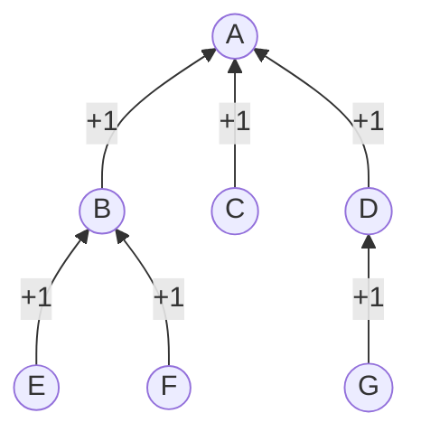

# G - Tree

## Analysis

To solve this problem, you need to understand what is a rooted tree. When a tree is rooted, each node (except the root) will have exactly $$1$$ parent node (i.e., the node connected to it that is closer to the root) and a number of children nodes.

Therefore, the number of children is the number of edge connected to it $$- 1$$ (except for root).

Alternatively, you can enumerate the parent from $$2$$ to $$n$$. The number of time a number appears as parent is the number of children.

Then, you just need to have two arrays one act as a lookup table of how many children that node have and another act as another lookup table of how many node with that amount of children.

The graph below illustrates an example.



## Codes



```c
#include <stdio.h>
#include <stdlib.h>
#include <string.h>

void solve(int n, int *parents, int *result) {
  int *num_children = (int *)calloc(n, sizeof(int));
  memset(num_children, 0, n * sizeof(int));
  for (int i = 0; i < n - 1; ++i) {
    num_children[parents[i] - 1]++;
  }
  for (int i = 0; i < n; ++i) {
    result[num_children[i]]++;
  }
  free(num_children);
}

int main() {
  int n;
  scanf("%d", &n);
  int *parents = (int *)calloc(n - 1, sizeof(int));
  for (int i = 2; i <= n; ++i) {
    scanf("%d", &parents[i - 2]);  // parents[i - 2] is the parent of i
  }
  int *result = (int *)calloc(n, sizeof(int));
  memset(result, 0, n * sizeof(int));
  solve(n, parents, result);
  for (int i = 0; i < n; i++) {
    printf("%d ", result[i]);
  }
  free(parents);
  free(result);
  return 0;
}
```



```cpp
#include <iostream>
#include <vector>

class Solution {
 public:
  /**
   * @param n: number of nodes
   * @param parent: parent of each node where the $i$-th index is the parent of
   * the $i$-th node (in one index). For eg, parent[2] is the parent of node 2
   * Thus the parent[0] = parent[1] = -1;
   * @return: return an array of size $n$ where the $i$-th index is the number
   * of nodes that have $i$ children
   */
  static std::vector<int> solve(int n, std::vector<int>& parent) {
    std::vector<int> ans(n), child(n + 1);
    for (int i = 2; i <= n; ++i) child[parent[i]]++;
    for (int i = 1; i <= n; ++i) ans[child[i]]++;
    return ans;
  }
};
int main() {
  int n;
  std::cin >> n;
  std::vector<int> parent(n + 1);
  for (int i = 2; i <= n; ++i) std::cin >> parent[i];
  std::vector<int> ans = Solution::solve(n, parent);
  for (auto x : ans) {
    std::cout << x << ' ';
  }
  std::cout << std::endl;
  return 0;
}
```



```java
import java.util.Scanner;

class Solution {
  /**
   * @param n: number of nodes
   * @param parent: parent of each node where the $i$-th index is the parent of the $i$-th node (in
   *     one index). For eg, parent[2] is the parent of node 2
   * Thus the parent[0] = parent[1] = -1;
   * @return: return an array of size $n$ where the $i$-th index is the number of nodes that have
   * $i$ children
   */
  static int[] solve(int n, int[] parent) {
    int[] ans = new int[n];
    int[] nchildren = new int[n + 1];

    for (int i = 2; i <= n; i++) {
      nchildren[parent[i]]++;
    }

    for (int i = 1; i <= n; i++) {
      ans[nchildren[i]]++;
    }
    return ans;
  }

  public static void main(String[] args) throws java.lang.Exception {
    Scanner input = new Scanner(System.in);

    int n = input.nextInt();
    int[] p = new int[n + 1];
    for (int i = 2; i <= n; i++) {
      p[i] = input.nextInt();
    }
    p[0] = p[1] = -1;

    int[] ans = solve(n, p);
    for (int i = 0; i < n; i++) {
      System.out.print(ans[i] + " ");
    }
    System.out.println();

    input.close();
  }
}
```



```python
class Solution:
    @staticmethod
    def solve(n: int, parent: dict[int, int]) -> list[int]:
        """
        Args:
            n (int): number of nodes
            parent (dict[int, int]): parent of each node where the i-th index is the parent of
                                      the i-th node (in 1 index). For example, parent[2] is the parent of node 2.

        Returns:
            list[int]: an array of size n where the i-th index is the number of nodes that have i children
        """
        # Implement your solution here
        result = [0] * n
        num_children = [0] * n
        for i in range(2, n + 1):
            num_children[parent[i] - 1] += 1
        for i in range(n):
            result[num_children[i]] += 1
        return result


if __name__ == "__main__":
    n = int(input())
    parent_list = list(map(int, input().split()))
    parent = {i + 2: parent_list[i] for i in range(n - 1)}
    solution = Solution.solve(n, parent)
    print(*solution)
```


