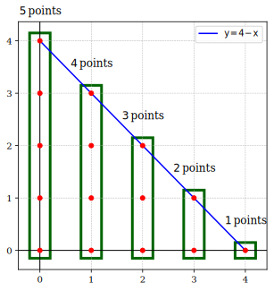

# A - Triangle

## 80 pts: $$a=b$$

We can draw:

<div style="text-align: center;">
  
</div>

So the answer is:

$$
s = (a + 1) + a + \cdots + 1 = \frac{(a + 2)(a + 1)}{2}
$$



```python
class Solution:
    @staticmethod
    def solve(a: int, b: int) -> int:
        return (a + 1) * (b + 2) // 2


if __name__ == "__main__":
    a, b = map(int, input().split())
    print(Solution.solve(a, b))
```


```c
#include <stdio.h>

int64_t solve(int a, int b);

int main() {
  int a, b;
  scanf("%d%d", &a, &b);
  printf("%" PRId64 "\n", solve(a, b));
  return 0;
}

int64_t solve(int a, int b) { return (int64_t)(a + 1) * (b + 2) / 2; }
```


```cpp
#include <iostream>

int64_t solve(int a, int b);

int main() {
  int a, b;
  std::cin >> a >> b;
  std::cout << solve(a, b) << std::endl;
  return 0;
}

int64_t solve(int a, int b) { return (int64_t)(a + 1) * (b + 2) / 2; }
```


```java
import java.util.Scanner;

public class Solution {
  static long solve(int a, int b) {
    return (long) (a + 1) * (b + 2) / 2;
  }

  public static void main(String[] args) {
    Scanner scanner = new Scanner(System.in);
    int a = scanner.nextInt();
    int b = scanner.nextInt();
    System.out.println(solve(a, b));
  }
}
```


```go
package main

import "fmt"

func solve(a, b int) int {
	return (a + 1) * (b + 2) / 2
}

func main() {
	var a, b int
	fmt.Scan(&a, &b)
	fmt.Println(solve(a, b))
}
```



## 100 pts: $$a \neq b$$

We can draw the triangle:

<div style="text-align: center; width: 70%; margin: 0 auto;">
  
</div>

## GCD Solutions

<div style="text-align: center; width: 80%; margin: 0 auto;">
  
</div>




```java
import java.util.Scanner;

public class Solution {
  public static int gcd(int a, int b) {
    while (b != 0) {
      int temp = b;
      b = a % b;
      a = temp;
    }
    return a;
  }

  public static void main(String[] args) {
    Scanner scanner = new Scanner(System.in);
    int a = scanner.nextInt();
    int b = scanner.nextInt();
    System.out.println(((long) (a + 1) * (b + 1) + gcd(a, b) + 1) / 2);
    scanner.close();
  }
}
```



```go
package main

import "fmt"

func gcd(a, b int) int {
	for b != 0 {
		a, b = b, a%b
	}
	return a
}

func solve(a, b int) int {
	return ((a+1)*(b+1) + gcd(a, b) + 1) / 2
}

func main() {
	var a, b int
	fmt.Scan(&a, &b)
	fmt.Println(solve(a, b))
}
```


