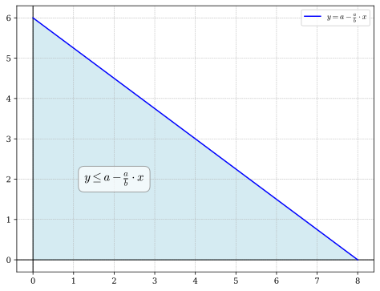

# A - Triangle

## 80 pts: $$a=b$$

We can draw:

<div style="text-align: center;">
  
</div>

So the answer is:

$$
s = (a + 1) + a + \cdots + 1 = \frac{(a + 2)(a + 1)}{2}
$$



```python
class Solution:
    @staticmethod
    def solve(a: int, b: int) -> int:
        return (a + 1) * (b + 2) // 2


if __name__ == "__main__":
    a, b = map(int, input().split())
    print(Solution.solve(a, b))
```


```c
#include <stdio.h>

int64_t solve(int a, int b);

int main() {
  int a, b;
  scanf("%d%d", &a, &b);
  printf("%" PRId64 "\n", solve(a, b));
  return 0;
}

int64_t solve(int a, int b) { return (int64_t)(a + 1) * (b + 2) / 2; }
```


```cpp
#include <iostream>

int64_t solve(int a, int b);

int main() {
  int a, b;
  std::cin >> a >> b;
  std::cout << solve(a, b) << std::endl;
  return 0;
}

int64_t solve(int a, int b) { return (int64_t)(a + 1) * (b + 2) / 2; }
```


```java
import java.util.Scanner;

public class Solution {
  static long solve(int a, int b) {
    return (long) (a + 1) * (b + 2) / 2;
  }

  public static void main(String[] args) {
    Scanner scanner = new Scanner(System.in);
    int a = scanner.nextInt();
    int b = scanner.nextInt();
    System.out.println(solve(a, b));
  }
}
```


```go
package main

import "fmt"

func solve(a, b int) int {
	return (a + 1) * (b + 2) / 2
}

func main() {
	var a, b int
	fmt.Scan(&a, &b)
	fmt.Println(solve(a, b))
}
```



## 100 pts: $$a \neq b$$

We can draw the triangle:

<div style="text-align: center; width: 70%; margin: 0 auto;">
  
</div>

So we need to count $$(x, y)$$ such that:

$$
y\le a - \frac{a}{b}x
$$

For all $$x\in [0, b]$$, we need:

$$
0\le y\le a-\frac{a}{b}x
$$

So for one $$x$$, we have $$1 + \left\lfloor a-\frac{a}{b}x\right\rfloor$$ valid $$y$$.

So the answer is:

$$
\sum_{x=0}^b 1 + \left\lfloor a-\frac{a}{b}x\right\rfloor
$$

We can compute this in $$\mathcal{O}(\max\{a, b\})$$ time.



```python
class Solution:
    @staticmethod
    def solve(a: int, b: int) -> int:
        ans = 0
        for x in range(b + 1):
            ans += a * x // b + 1
        return ans


if __name__ == "__main__":
    a, b = map(int, input().split())
    print(Solution.solve(a, b))
```


```c
#include <inttypes.h>
#include <stdint.h>
#include <stdio.h>

int64_t solve(int a, int b);

int main() {
  int a, b;
  scanf("%d%d", &a, &b);
  printf("%" PRId64 "\n", solve(a, b));
  return 0;
}

int64_t solve(int a, int b) {
  int64_t ans = 0;
  for (int x = 0; x <= b; ++x) {
    ans += (int64_t)a * x / b + 1;
  }
  return ans;
}
```


```cpp
#include <cstdint>
#include <iostream>

class Solution {
 public:
  static int64_t solve(int a, int b) { return (int64_t)(a + 1) * (b + 2) / 2; }
};

int main() {
  int a, b;
  std::cin >> a >> b;
  std::cout << Solution::solve(a, b) << std::endl;
  return 0;
}
```


```java
import java.util.Scanner;

public class Solution {
  static long solve(int a, int b) {
    long ans = 0;
    for (int x = 0; x <= b; x++) {
      ans += (long) a * x / b + 1;
    }
    return ans;
  }

  public static void main(String[] args) {
    Scanner scanner = new Scanner(System.in);
    int a = scanner.nextInt();
    int b = scanner.nextInt();
    System.out.println(solve(a, b));
    scanner.close();
  }
}
```


```go
package main

import "fmt"

func solve(a, b int) int {
	ans := 0
	for x := 0; x <= b; x++ {
		ans += a*x/b + 1
	}
	return ans
}

func main() {
	var a, b int
	fmt.Scan(&a, &b)
	fmt.Println(solve(a, b))
}
```




## GCD Solutions

We need to discover some properties:

<div style="text-align: center; width: 80%; margin: 0 auto;">
  
</div>

For simplicity:

$$\triangle = \frac{\square + \diagdown}{2}$$

It is easy to know that

$$\square = (a + 1) (b+1)$$

So the question is to calculate $$\diagdown$$.

An observation is

$$\diagdown = \diagup$$

So we need to count $$(x, y)$$ such that:

$$
y=\frac{a}{b}x\Longrightarrow ax=by
$$

Let $$c = ax=by$$, we have $$a, b\mid c$$, which is

$$
c = k\cdot \text{lcm}(a, b), k\in\mathbb{Z}
$$

And we have constrain $$0\le c\le ab$$ as $$0\le x\le b, 0\le y\le a$$.

$$
0\le k\cdot \text{lcm}(a, b)\le ab\Longrightarrow 0\le k\le \frac{ab}{\text{lcm}(a, b)}=\gcd(a, b)
$$

So

$$
\diagdown = \gcd(a, b) + 1
$$

Which means the answer is

$$
\triangle = \frac{\square + \diagdown}{2} = \frac{(a+1)(b+1)+\gcd(a, b) + 1}{2}
$$

We can use [Euclidean algorithm](https://en.wikipedia.org/wiki/Euclidean_algorithm) to calculate $$\gcd(a, b)$$ in $$\mathcal{O}(\log \max\{a, b\})$$ time. (Or [`std::gcd`](https://en.cppreference.com/w/cpp/numeric/gcd) in C++, [`math.gcd`](https://docs.python.org/3/library/math.html#math.gcd) in Python).




```java
import java.util.Scanner;

public class Solution {
  public static int gcd(int a, int b) {
    while (b != 0) {
      int temp = b;
      b = a % b;
      a = temp;
    }
    return a;
  }

  public static void main(String[] args) {
    Scanner scanner = new Scanner(System.in);
    int a = scanner.nextInt();
    int b = scanner.nextInt();
    System.out.println(((long) (a + 1) * (b + 1) + gcd(a, b) + 1) / 2);
    scanner.close();
  }
}
```



```go
package main

import "fmt"

func gcd(a, b int) int {
	for b != 0 {
		a, b = b, a%b
	}
	return a
}

func solve(a, b int) int {
	return ((a+1)*(b+1) + gcd(a, b) + 1) / 2
}

func main() {
	var a, b int
	fmt.Scan(&a, &b)
	fmt.Println(solve(a, b))
}
```



## Bézout's Identity

At first, I didn't find $$\diagdown = \diagup$$, so I tried to solve $$\diagdown$$ directly.

We can have:

$$
y = a - \frac{a}{b}x \Longrightarrow ax + by = ab
$$

This is a classic Linear Diophantine equation, which can be easily solved using
[Extended Euclidean Algorithm](https://cp-algorithms.com/algebra/linear-diophantine-equation.html)
and [Bézout's identity](https://en.wikipedia.org/wiki/Bézout_identity).

This approach also has a time complexity of $$\mathcal{O}(\log \max\{a, b\})$$.



```c
#include <inttypes.h>
#include <stdint.h>
#include <stdio.h>

int64_t solve(int a, int b);

int main() {
  int a, b;
  scanf("%d%d", &a, &b);
  printf("%" PRId64 "\n", solve(a, b));
  return 0;
}

int exgcd(int a, int b, int64_t *x, int64_t *y) {
  if (b == 0) {
    *x = 1;
    *y = 0;
    return a;
  }
  int g = exgcd(b, a % b, x, y);
  int64_t t = *x;
  *x = *y;
  *y = t - a / b * *y;
  return g;
}

/**
 * Number of solutions of ax + by = a * b
 */
int64_t sol_num(int a, int b) {
  int64_t x, y;
  int g = exgcd(a, b, &x, &y);
  int64_t lcm = a / g * b;
  x *= lcm;
  y *= lcm;

  // now we have a * x + b * y = a * b
  // a * (x + k * b / g) + b * (y - k * a / g) = a * b
  // a * x + b * y = a * b
  // so x = x + k * b / g, y = y - k * a / g
  // we need x >= 0, y >= 0
  // so - g * x / b <= k <= g * y / a
  // so the answer is g * y / a + g * x / b + 1
  return g * y / a + g * x / b + 1;
}

int64_t solve(int a, int b) {
  return ((int64_t)(a + 1) * (b + 1) + sol_num(a, b)) / 2;
}
```


```go
package main

import "fmt"

func exgcd(a, b int) (int, int, int) {
	if b == 0 {
		return a, 1, 0
	}
	g, x, y := exgcd(b, a%b)
	return g, y, x - a/b*y
}

// Number of solutions of ax + by = a * b
func sol_num(a, b int) int {
	g, x0, y0 := exgcd(a, b)

	lcm := a / g * b
	x0 *= lcm
	y0 *= lcm

	// now we have a * x0 + b * y0 = a * b
	// a * (x0 + k * b / g) + b * (y0 - k * a / g) = a * b
	// a * x + b * y = a * b
	// so x = x0 + k * b / g, y = y0 - k * a / g
	// we need x >= 0, y >= 0
	// so - g * x0 / b <= k <= g * y0 / a
	// so the answer is g * y0 / a + g * x0 / b + 1
	return g*y0/a + g*x0/b + 1
}

func solve(a, b int) int {
	return ((a+1)*(b+1) + sol_num(a, b)) / 2
}

func main() {
	var a, b int
	fmt.Scan(&a, &b)
	fmt.Println(solve(a, b))
}
```



## Pick's theorem

Suppose that a polygon has integer coordinates for all of its vertices:

$$\mathcal{A} = \mathcal{I} + \frac{\mathcal{B}}{2} - 1$$

- $$\mathcal{A}$$ is the area of the polygon
- $$\mathcal{I}$$ is the number of interior points
- $$\mathcal{B}$$ is the number of boundary points

So the answer is

$$
\mathcal{I} + \mathcal{B} = \left(\mathcal{A} - \frac{\mathcal{B}}{2} + 1\right) + \mathcal{B} = \mathcal{A} + \frac{\mathcal{B}}{2} + 1 = \frac{ab}{2} + 1 + \frac{\mathcal{B}}{2}
$$

So the question is the find $$\mathcal{B}$$, which is

$$
a + b - 1 + \diagdown = a + b + \gcd(a, b)
$$

So

$$
\mathcal{I} + \mathcal{B} = \frac{ab + a + b + \gcd(a, b)}{2} + 1
$$
