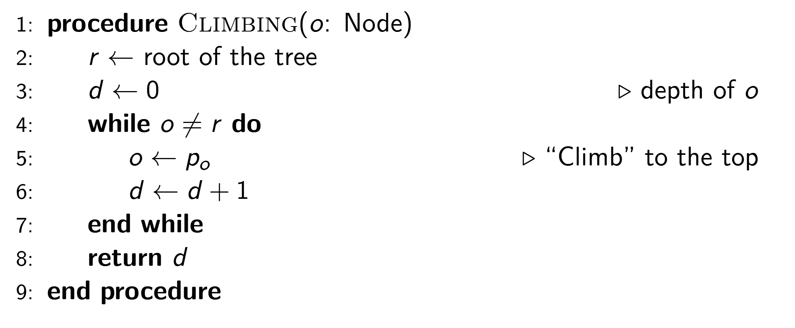
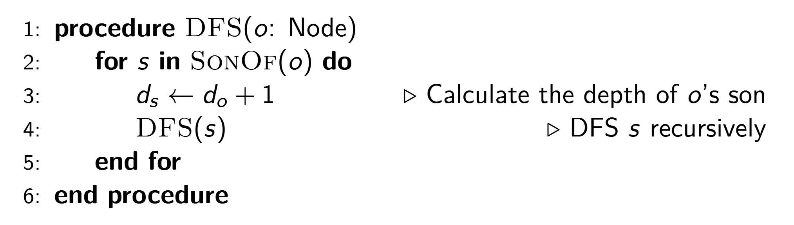
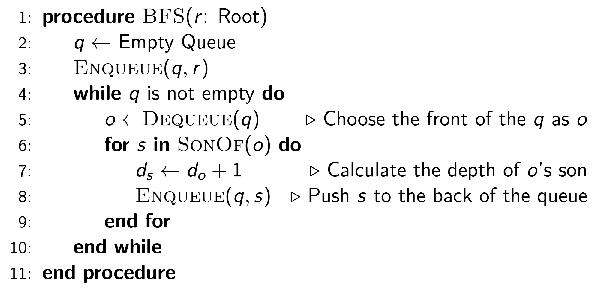

# B - Tree 2

## 30 pts? 60 pts!

Idea: for all nodes, "climbing" to the root

This algo actually earns 60 pts!

Because the tree generated randomly using $$ p_i = \text{rand}(1, i-1) $$ has an expected depth of $$ \mathcal{O}(\log n) $$.

The proof will be at the end of the solution.

## 100 pts

DFS and BFS is a good idea for most of the tree problem, because this method allows the entire tree to be traversed in a specific order.

In both types of search, the parent node always arrives before the child nodes.

So, if we let $$ d_i $$ be the distance of node $$ i $$, during our DFS/BFS, $$ d_{p_i} $$ is always computed before $$ d_i $$.

Here is the pseudocode for DFS:

Here is the pseudocode for BFS:

## Proof of expected depth of $$ \mathcal{O}(\log n) $$

Let

$$
d_i = \mathbb{E}[\text{depth of node } i]
$$

As $$ p_i \sim \text{uniform}(1, i-1) $$, we can have

$$
\begin{aligned}
d_i = \mathbb{E}_{p\sim \text{uniform}(1, i-1)}\left[d_{p} + 1\right] \\
        &= \mathbb{E}_{p\sim \text{uniform}(1, i-1)}\left[d_{p}\right] + 1 \\
        &= 1 + \frac{1}{i-1}\sum_{p=1}^{i-1}d_p\\
        &=1 + \frac{1}{i-1} d_{i-1} + \frac{1}{i-1} \sum_{p=1}^{i-2}d_p
\end{aligned}
$$

As

$$
d_i = 1 + \frac{1}{i-1}\sum_{p=1}^{i-1}d_p
$$

so

$$
\sum_{p=1}^{i-1}d_p = (i-1)(d_p-1)
$$

Thus

$$
\begin{aligned}
d_i&=1 + \frac{1}{i-1} d_{i-1} + \frac{1}{i-1} \sum_{p=1}^{i-2}d_p\\
        &=1 + \frac{1}{i-1} d_{i-1} + \frac{1}{i-1}\cdot (i-2) (d_{i-1} - 1)\\
        &=\frac{1}{i-1} + d_{i-1} = \sum_{j=1}^{i-1}\frac{1}{i}
    \end{aligned}
$$

So

$$
\mathbb{E}[\text{depth of node } i]=\sum_{j=1}^{i-1}\frac{1}{i}
$$

And this is a very famous formula called [Harmonic series](https://en.wikipedia.org/wiki/Harmonic_series_(mathematics)).

It can be easily proved that

$$
\mathbb{E}[\text{depth of node } i]=\sum_{j=1}^{i-1}\frac{1}{i}\le 1 + \int_1^{i-1}\frac{1}{x}\mathrm{d}x=1+\log (i-1)
$$
