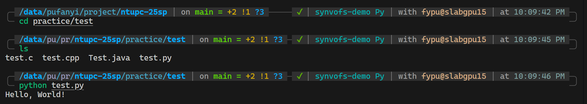
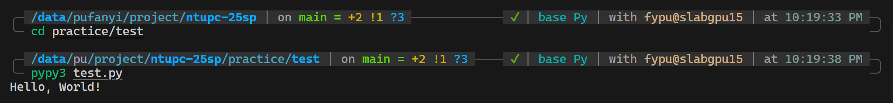

# Guide

## Visual Studio Code

### Installation

- Visit [https://code.visualstudio.com/](https://code.visualstudio.com/)
- Download the appropriate version for your operating system
- Follow the installation instructions

### Opening the Terminal in VS Code

VS Code has an integrated terminal that allows you to execute command-line operations without leaving the editor.

1. **Ways to open the terminal**:
   - Use the keyboard shortcut: 
     - Windows/Linux: `Ctrl + ` (backtick)
     - macOS: `Cmd + ` (backtick)
   - From the menu: View > Terminal
   - Use the command palette (`Ctrl+Shift+P` or `Cmd+Shift+P`), then type "Terminal: Create New Terminal"

2. **Terminal features**:
   - Multiple terminals: Click the + icon to create additional terminals
   - Split terminals: Use the split icon to divide the terminal panel
   - Terminal selection: Use the dropdown to switch between terminals
   - Terminal customization: Configure in Settings (`Ctrl+,` or `Cmd+,`)

### More Information

- [VS Code Documentation](https://code.visualstudio.com/docs)
- [VS Code Extensions](https://code.visualstudio.com/docs/editor/extension-gallery)

In the competition, you cannot install extensions with AI. We have installed most of the necessary extensions for you. If you need more extensions, please ask the organizers to install them for you in the competition.

## Compiling and Running Code from the Terminal

Before you start, you need to `cd` to the directory where your code is located.

```bash
cd /path/to/your/code
```

### C

1. **Compile a C program**:
   ```bash
   gcc -o program_name source_file.c -Wall -g
   ```
   - `-Wall`: Enable all warnings
   - `-g`: Include debugging information
   - `-o program_name`: Specify the output file name
   - More details can be found in [GCC Options Summary](https://gcc.gnu.org/onlinedocs/gcc/Option-Summary.html).

2. **Run the compiled program**:
   ```bash
   ./program_name
   ```


### C++

1. **Compile a C++ program**:
   ```bash
   g++ -o program_name source_file.cpp -Wall -g
   ```
   - `-Wall`: Enable all warnings
   - `-g`: Include debugging information
   - `-o program_name`: Specify the output file name
   - More details can be found in [GCC Options Summary](https://gcc.gnu.org/onlinedocs/gcc/Option-Summary.html).

2. **Run the compiled program**:
   ```bash
   ./program_name
   ```


### Java

1. **Compile a Java program**:
   ```bash
   javac FileName.java
   ```
   This creates a `FileName.class` file

2. **Run a Java program**:
   ```bash
   java FileName
   ```
   Note: Do not include the `.class` extension when running


### Python

#### CPython

```bash
python script.py
```



#### PyPy

```bash
pypy3 script.py
```



## Useful tools

### Miniconda

Miniconda is installed in the competition environment. You can create a new environment and install the packages you need.

```bash
conda create --name npc python=3.11
conda activate npc
```

You can use Jupyter Notebook in the competition environment. See [here](https://code.visualstudio.com/docs/datascience/jupyter-notebooks) for more information.

### GDB

GDB is installed in the competition environment. You can use it to debug your code.

```bash
gdb program_name
```

See [the official documentation](https://www.gnu.org/software/gdb/documentation/) for more information. And we strongly recommend you to read through [this tutorial](https://web.stanford.edu/class/archive/cs/cs107/cs107.1194/resources/gdb) to get familiar with GDB.
