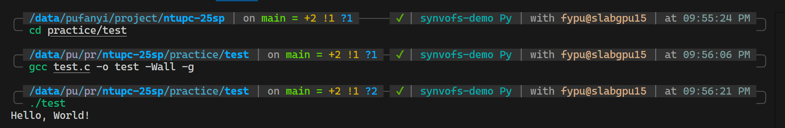
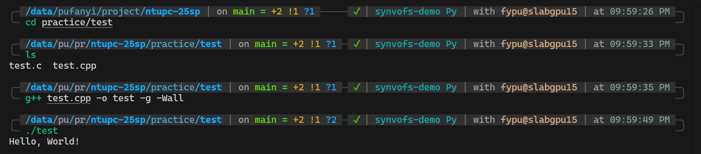
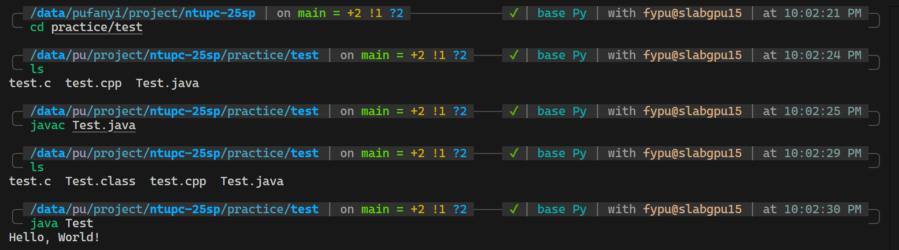

# Guide

## Visual Studio Code

Visual Studio Code (VS Code) is a lightweight but powerful source code editor that runs on your desktop. It comes with built-in support for JavaScript, TypeScript, and Node.js and has a rich ecosystem of extensions for other languages and tools.

### Installation

- Visit [https://code.visualstudio.com/](https://code.visualstudio.com/)
- Download the appropriate version for your operating system
- Follow the installation instructions

### Opening the Terminal in VS Code

VS Code has an integrated terminal that allows you to execute command-line operations without leaving the editor.

1. **Ways to open the terminal**:
   - Use the keyboard shortcut: 
     - Windows/Linux: `Ctrl + ` (backtick)
     - macOS: `Cmd + ` (backtick)
   - From the menu: View > Terminal
   - Use the command palette (`Ctrl+Shift+P` or `Cmd+Shift+P`), then type "Terminal: Create New Terminal"

2. **Terminal features**:
   - Multiple terminals: Click the + icon to create additional terminals
   - Split terminals: Use the split icon to divide the terminal panel
   - Terminal selection: Use the dropdown to switch between terminals
   - Terminal customization: Configure in Settings (`Ctrl+,` or `Cmd+,`)

### Useful VS Code Shortcuts

- `Ctrl+S` / `Cmd+S`: Save file
- `Ctrl+X` / `Cmd+X`: Cut line
- `Ctrl+C` / `Cmd+C`: Copy line
- `Ctrl+V` / `Cmd+V`: Paste
- `Ctrl+Z` / `Cmd+Z`: Undo
- `Ctrl+Shift+Z` / `Cmd+Shift+Z`: Redo
- `Ctrl+F` / `Cmd+F`: Find
- `Ctrl+H` / `Cmd+H`: Replace
- `F5`: Start debugging
- `Shift+F5`: Stop debugging
- `F11`: Step into
- `F10`: Step over

## Compiling and Running Code from the Terminal

### C

1. **Compile a C program**:
   ```bash
   gcc -o program_name source_file.c -Wall -g
   ```
   - `-Wall`: Enable all warnings
   - `-g`: Include debugging information
   - `-o program_name`: Specify the output file name
   - More details can be found in [GCC Options Summary](https://gcc.gnu.org/onlinedocs/gcc/Option-Summary.html).

2. **Run the compiled program**:
   ```bash
   ./program_name
   ```



### C++

1. **Compile a C++ program**:
   ```bash
   g++ -o program_name source_file.cpp -Wall -g
   ```
   - `-Wall`: Enable all warnings
   - `-g`: Include debugging information
   - `-o program_name`: Specify the output file name
   - More details can be found in [GCC Options Summary](https://gcc.gnu.org/onlinedocs/gcc/Option-Summary.html).

2. **Run the compiled program**:
   ```bash
   ./program_name
   ```



### Java

1. **Compile a Java program**:
   ```bash
   javac FileName.java
   ```
   This creates a `FileName.class` file

2. **Run a Java program**:
   ```bash
   java FileName
   ```
   Note: Do not include the `.class` extension when running



### Python

1. **Install Python**:
   - Download from [python.org](https://www.python.org/downloads/)
   - Ensure it's added to your PATH during installation

2. **Run a Python script**:
   ```bash
   python script.py
   ```
   or
   ```bash
   python3 script.py
   ```
   (depending on your installation)

3. **Python doesn't require compilation** in the traditional sense, but you can:
   - Check syntax without running:
     ```bash
     python -m py_compile script.py
     ```
   - Create a bytecode file:
     ```bash
     python -c "import py_compile; py_compile.compile('script.py')"
     ```

### Go

1. **Install Go**:
   - Download from [golang.org](https://golang.org/dl/)
   - Follow the installation instructions for your OS

2. **Compile and run in one step**:
   ```bash
   go run main.go
   ```

3. **Compile a Go program**:
   ```bash
   go build main.go
   ```
   This creates an executable file

4. **Run the compiled program**:
   - Windows: `main.exe`
   - macOS/Linux: `./main`
